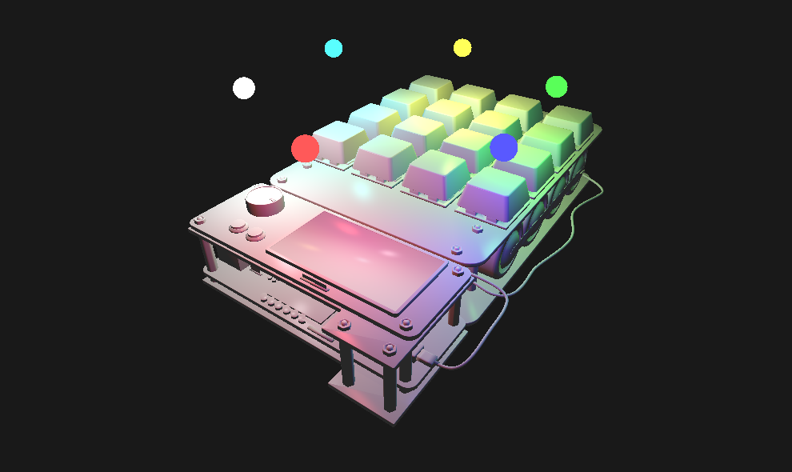

## Vulkan Tech Demo

My first game engine with basic Vulkan backend rendering, some simple shaders (multiple lights) and ECS implementation (EnTT)

WASD for standard moving, QE for height regulation, arrows for camera rotation (mouse)

Libraries I use:
- [GLM](https://github.com/g-truc/glm)
- [GLFW](https://github.com/glfw/glfw)
- [Vulkan](https://github.com/KhronosGroup/Vulkan-Hpp.git)
- [EnTT](https://github.com/skypjack/entt)
- [ImGui](https://github.com/ocornut/imgui) (don't use)
- [Bullet Physics SDK](https://github.com/bulletphysics/bullet3) (don't use)

Guides I read/watch for this demo
- [Vulkan Game Engine Tutorials](https://youtube.com/playlist?list=PL8327DO66nu9qYVKLDmdLW_84-yE4auCR&si=sYuNqZ_-I2fiC8TS) - Based on, 80% from here
- [Vulkan Tutorial](https://vulkan-tutorial.com/Development_environment) - Original text version of previous tutorial

Also usable docs
- [ECS in EnTT](https://github.com/skypjack/entt/wiki/Entity-Component-System)
- [ImGui Guide 1](https://github.com/ocornut/imgui/blob/master/examples/example_glfw_vulkan/main.cpp)
- [Bullet3 Guide 1](https://habr.com/ru/articles/709498/)

CMake project based on [my template](https://github.com/vertoker/cmake-template)
